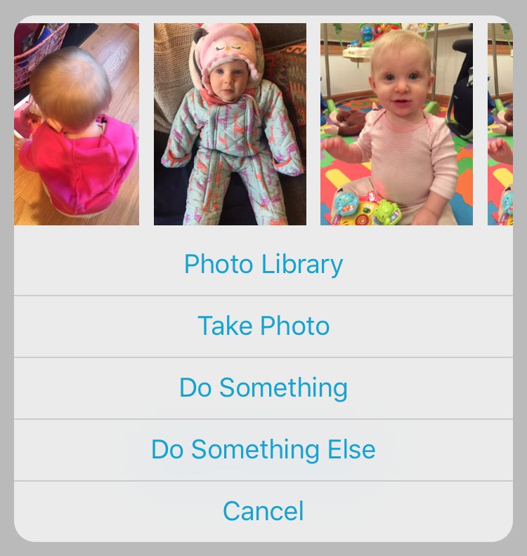

## DCPhotoPicker

This is a simple popup photo picker written in Objective-C.  Highly customizable and cleans up nicely when deallocating.  I've used this in previous apps but no longer maintain this code, so I'm putting the source here for those who wish to use or fork it.

### Previews



### Usage

```objc
- (void)openPhotoPicker
{
    DCPhotoPicker *photoPicker = [[DCPhotoPicker alloc] initWithTitle:@"Photo Library"
                                         alternateTitle:@"Use Selected Photo"
                                            otherTitles:@[ @"Take Photo", @"Do Something", @"Do Something Else" ]
                                            cancelTitle:@"Cancel"];
    photoPicker.delegate = self;
    photoPicker.themeColor = [UIColor colorWithRed:23/255.0f green:163/255.0f blue:209/255.0f alpha:1.0f];
    photoPicker.maxSelectCount = 1;
    photoPicker.buttonFont = [UIFont systemFontOfSize:19.0f];
    photoPicker.buttonFontColor = [UIColor colorWithRed:23/255.0f green:163/255.0f blue:209/255.0f alpha:1.0f];

    [self presentViewController:photoPicker animated:YES completion:nil];
}
```

```objc
- (BOOL)photoPickerShouldDismissWithAssets:(NSArray *)assets {}
- (void)photoPickerAssetsSelected:(NSArray *)assets {}
- (void)photoPickerButtonItemClicked:(NSInteger)itemIndex {}
- (void)photoPickerWillDismiss {}
- (void)photoPickerDidDismiss {}
```

#### License

This project is available under the MIT license. See the LICENSE file for more info.
